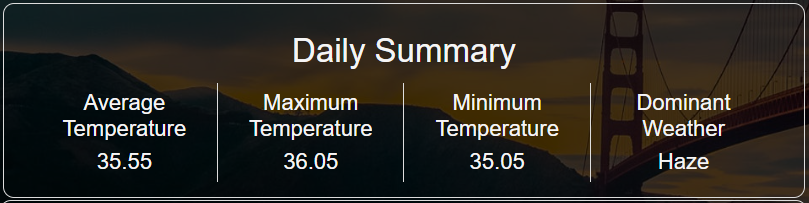

### WeatherApp

# 🌦️ Live Weather Updates Website


## 🌟 Introduction

Welcome to the Live Weather Updates Website! This single-page application is built using the MERN stack and provides real-time weather updates for your desired location. Leveraging the OpenWeatherMap API, it not only shows the current weather but also displays daily and weekly summaries using data roll-ups and aggregates. You can set a temperature threshold, and the website will alert you if the current temperature exceeds your specified limit.

## 🌐 Features

- **Real-time Weather Updates:** 
  - Get up-to-date weather information for any location.
  - Displays current temperature, humidity, wind speed, and visibility.
- **Daily Summary:** View a summary of the weather for the current day.
- **Weekly Summary:** Check out the weather trends for the week.
- **Temperature Alerts:** Set a temperature threshold and receive alerts when it's breached.
- **User-friendly Interface:** Simple and intuitive design for a seamless user experience.

## 🛠️ Technologies Used

- **MERN Stack:**
  - **MongoDB:** For storing weather data and summaries.
  - **Express.js:** For creating the backend API.
  - **React:** For building the frontend interface.
  - **Node.js:** For running the backend server.
- **OpenWeatherMap API:** To fetch live weather data.
- **Axios:** For making API requests.
- **React-Toastify:** For displaying alerts and notifications.
- **React Live Clock:** For showing the current time.
- **CSS:** For styling the application.

## 📈 Data Roll-up and Aggregates

The website uses data roll-ups and aggregates to provide insightful weather summaries. Daily summaries are stored and displayed at the end of each day, and weekly summaries give you an overview of the weather trends.

## 📸 Screenshots


*Daily summary with temperature and weather conditions.*


*Weekly weather trends and summary.*


*Weather Threshold breach Alert*

## 🚀 Getting Started

### Prerequisites

Make sure you have the following installed:

- Node.js
- MongoDB

### Installation

  # Clone the repository:

  # Running the backend.
  1. Go inside the server folder using (cd weatherApp-backend)
  2. create a .env folder with the following variables.

      PORT=5000
      MONGO_DB_URI='YOUR MONODB DATABASE CONNECTION URL'
      ApiKey='YOUR OPEN WEATHER MAP API KEY'  //First SignUp on openweather website and create your api key.

  3. In the server folder run the command (npm i) to install all the node modules listed int the package.json file.
  4. Run the (npm start) command to run the backend server and successfully connect to the Mongodb using mongoose.
  
    Commands:

      ```bash
      cd weatherApp-backend
      npm i
      npm start
      ```

  # Running the frontend.
  1. Go inside the frontend folder(cd weatherApp-frontend).
  2. In the frontend run command (npm i) to install all the node modules listed int  the package.json file.
  3. Run the (npm start) command to run the frontend.

    Commands:

    ```bash
    cd weatherApp-frontend
    npm i
    npm start
    ```

The app will be running at `http://localhost:3000` and the server at `http://localhost:5000`.

## 📬 Feedback and Contributions

We welcome feedback and contributions! Feel free to open issues or submit pull requests to help improve the website.
